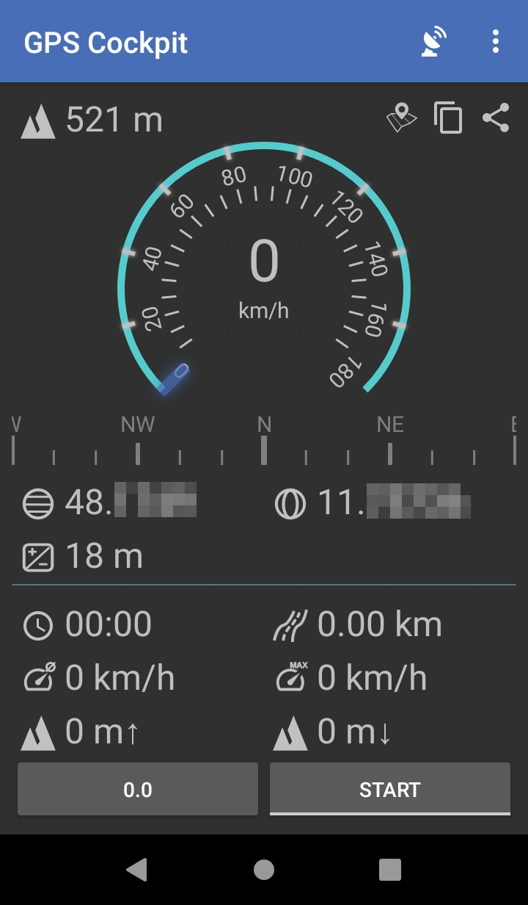
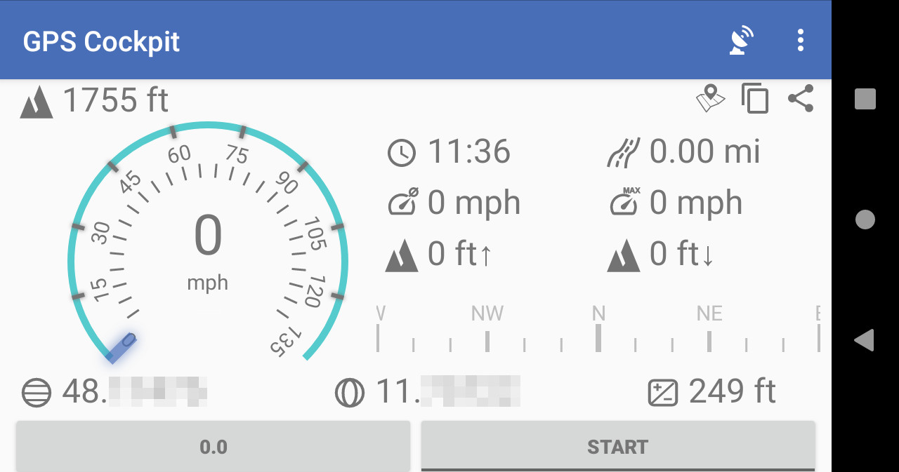
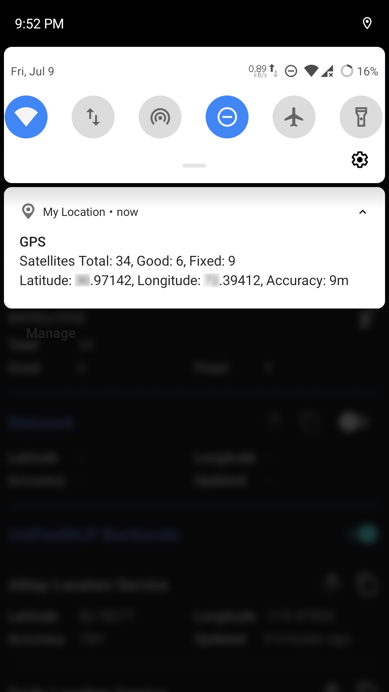

# MyLocation 
Know your geo coordinates using on-device GPS and Network location providers

<!-- a href="https://f-droid.org/packages/com.mirfatif.mylocation"></a>
<a href="https://play.google.com/store/apps/details?id=com.mirfatif.mylocation.ps"></a -->

## Features

My Location finds your device's location in the following ways:

* GPS is usually the most accurate method. But a position fix may take some time or may not work at all due to signal loss. "Lock GPS" feature runs a persistent service to keep connected with the satellites.

  You can also see the list of visible satellites with their PRNs (unique identifiers) and SNR (signal quality).
 
* Network Location Provider uses Wi-Fi or Cellular ids to estimate the location. On the devices with Google Play Services installed, NLP usually uses Google Location Service at backend.
* UnifiedNLP is an open source API which has been used to develop multiple NLP backends (https://github.com/microg/UnifiedNlp/wiki/Backends).

Furthermore:

* Location coordinates can be copied to clipboard or opened in a maps app, if installed.
* Clearing A-GPS aiding data is also supported.

## Screenshots

  

## Third-Party Resources

* https://github.com/androidx/androidx
* https://github.com/microg/android_external_UnifiedNlpApi
* https://github.com/square/leakcanary
* https://github.com/sherter/google-java-format-gradle-plugin

## License 

You **CANNOT** use and distribute the app icon in anyway, except for **My Location** (`com.mirfatif.mylocation`) app.

    My Location is free software: you can redistribute it and/or modify
    it under the terms of the Affero GNU General Public License as published by
    the Free Software Foundation, either version 3 of the License, or
    (at your option) any later version.

    This program is distributed in the hope that it will be useful,
    but WITHOUT ANY WARRANTY; without even the implied warranty of
    MERCHANTABILITY or FITNESS FOR A PARTICULAR PURPOSE.  See the
    Affero GNU General Public License for more details.

    You should have received a copy of the Affero GNU General Public License
    along with this program.  If not, see <https://www.gnu.org/licenses/>.
